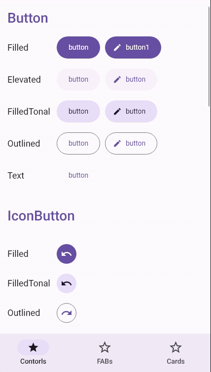

# Material.Components.Maui

中文 | [English](README.md)

Material3 Components for .NET MAUI, powered by SkiaSharp




## 快速开始

- 克隆这个仓库,  以及在你的maui项目中引用
- 在你的"MauiProgram.cs"添加 UseMaterialComponents

```C#
using Material.Components.Maui.Extensions;

namespace SampleApp;
public static class MauiProgram
{
    public static MauiApp CreateMauiApp()
    {
        var builder = MauiApp.CreateBuilder();
        builder
            .UseMauiApp<App>()
            .UseMaterialComponents(new List<string>
            {
                //一般情况下, 我们需要6种类型的字体
                "xxx-Regular.ttf",
                "xxx-Italic.ttf",
                "xxx-Medium.ttf",
                "xxx-MediumItalic.ttf",
                "xxx-Bold.ttf",
                "xxx-BoldItalic.ttf",
            });
        return builder.Build();
    }
}
```

- 在你的"App.xaml"添加 Material的颜色和风格

```xaml
<?xml version="1.0" encoding="UTF-8" ?>
<Application
    x:Class="SampleApp.App"
    xmlns="http://schemas.microsoft.com/dotnet/2021/maui"
    xmlns:x="http://schemas.microsoft.com/winfx/2009/xaml"
    xmlns:local="clr-namespace:SampleApp"
    xmlns:mds="clr-namespace:Material.Components.Maui.Styles;assembly=Material.Components.Maui">
    <Application.Resources>
        <ResourceDictionary>
            <ResourceDictionary.MergedDictionaries>
                <ResourceDictionary Source="Resources/Styles/Colors.xaml" />
                <ResourceDictionary Source="Resources/Styles/Styles.xaml" />
                <mds:MaterialStyles />
                <!--或者使用种子颜色
                <mds:MaterialStyles Dark="DarkBlue" Light="Green" />-->
            </ResourceDictionary.MergedDictionaries>
        </ResourceDictionary>
    </Application.Resources>
</Application>
```

- 开始吧!


## 可用的控件

> 😄: 准备就绪   🤔: 未经验证     😭: 需要帮助

| control   | android    | windows   |  ios&mac   |
| ---- | ---- | ---- |----|
| button    | 😄 | 😄 | 🤔 |
| IconButton | 😄 | 😄 |🤔|
| Card | 😄 | 😄 |🤔|
| CheckBox | 😄 | 😄 |🤔|
| Chip | 😄 | 😄 |🤔|
| ComboBox | 😄 | 😄 |😭|
| FAB | 😄 | 😄 |🤔|
| Label | 😄 | 😄 |🤔|
| NavigationBar | 😄 | 😄 |🤔|
| RadioButton | 😄 | 😄 |🤔|
| Switch | 😄 | 😄 |🤔|

## 贡献

计划为这个库做贡献？我们很高兴有你的加入


## 许可证

MIT


## 文档

TODO

